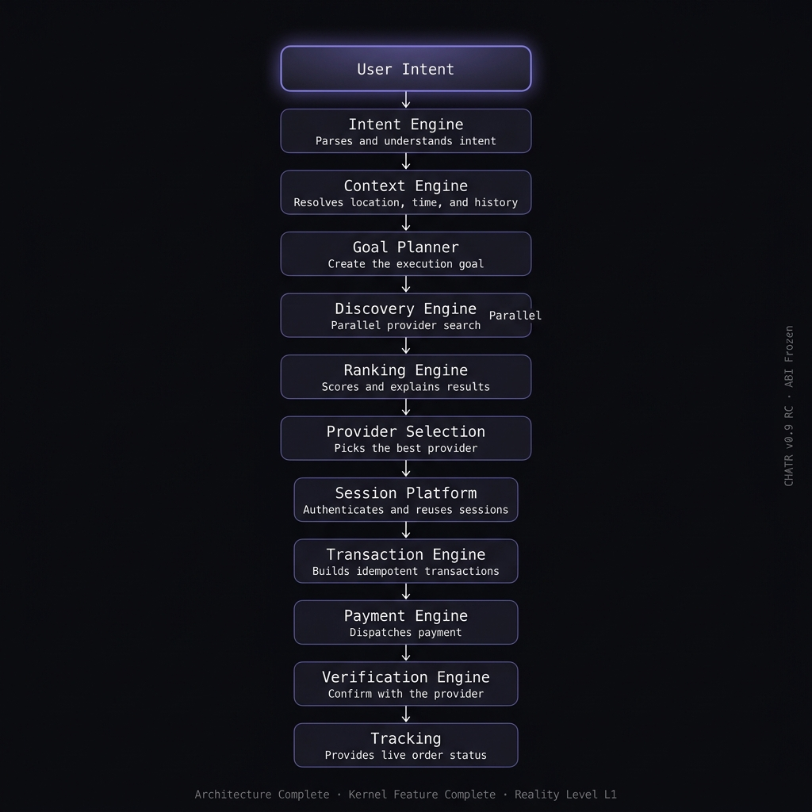

# CHATR OS

> **CHATR succeeds when users stop thinking about apps and start thinking only about goals.**

CHATR is an Intent Operating System that replaces traditional app-centric workflows with a unified, intent-driven execution pipeline. 

The architecture is designed to understand user intent, parallelize provider discovery, resolve sessions securely, build idempotent transactions, execute payments, and track live order status—all through a single, generic execution runtime.

## Platform Status
- **Architecture**: COMPLETE
- **Kernel**: FROZEN
- **ABI**: FROZEN
- **Hero Experience**: COMPLETE (Zomato/Swiggy Live Extraction)
- **Current Phase**: Product Validation Sprint

## The Signature Experience
CHATR is designed to make execution feel inevitable. The system pre-warms sessions, detects provider constraints (like web-based checkout blocks), dynamically routes execution through fallback providers, and prepares payments while the user is still reading the recommendations.

## Frozen ABIs
The following core ABIs are frozen. Any changes require an Architecture Decision Record (ADR) and explicit approval from the Technical Steering Committee:
- `chatr.discovery_result.v0_9_rc`
- `chatr.provider_session.v0_9_rc`
- `chatr.transaction.v0_9_rc`
- `chatr.workflow_graph.v0_9_rc`
- `chatr.provider_manifest.v0_9_rc`
- `chatr.connector_interface`

## Execution Pipeline
1. **User Intent** — Natural language or structured input
2. **Intent Engine** — Parses and understands the intent
3. **Context Engine** — Resolves location, time, history
4. **Goal Planner** — Creates the execution goal
5. **Discovery Engine** — Parallel provider search across the Connector Registry
6. **Ranking Engine** — Scores and explains results
7. **Provider Intelligence** — Capability routing and fallback handling
8. **Session Platform** — Authenticates and reuses sessions securely
9. **Transaction Engine** — Builds idempotent transactions
10. **Payment Engine** — Dispatches payment
11. **Verification Engine** — Confirms with the provider
12. **Tracking** — Live status polling
