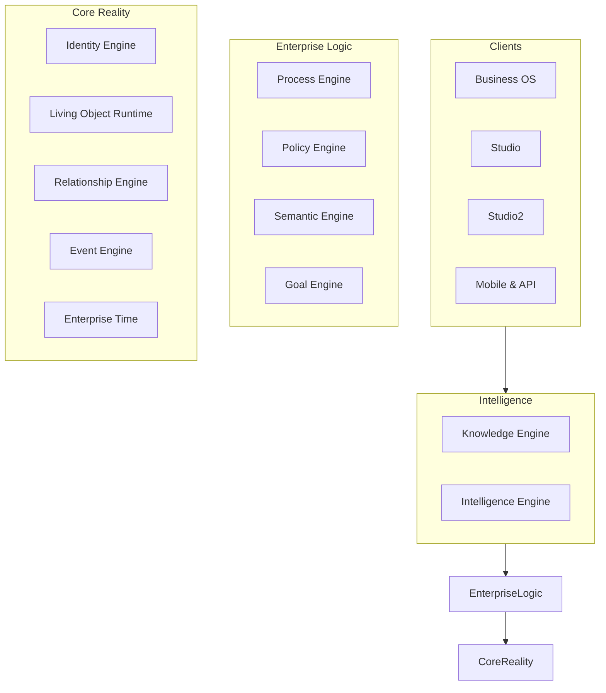

# CHATR OS Architecture Handbook

Welcome to the CHATR OS Architecture Handbook. This is the living constitution for the CHATR OS platform. It defines not just *how* the platform works, but *why* every major architectural decision exists.

> "Write the handbook so that a new engineer joining the team in two years can understand not just how the platform works, but why every major architectural decision exists."

## Table of Contents

### Core Architecture
- [Vision & Strategy](./vision.md)
- [Design Principles](./principles.md) - **Start Here.** The immutable rules of the platform.
- [The Enterprise Kernel](./kernel.md) - The 10 immutable concepts and 11 core engines.
- [The Universal Runtime](./runtime.md) - How the platform executes work.
- [Execution Pipeline](./execution-pipeline.md) - The path from User Intent → Evidence → LLM.
- [Migration Roadmap](./migration-roadmap.md) - The 8-phase plan for migrating to the Kernel.

### The Enterprise Kernel (Engines)
Detailed specifications for the 11 immutable engines that comprise the Kernel:
- [Identity Engine](./engines/identity.md)
- [Living Object Runtime](./engines/object.md)
- [Relationship Engine](./engines/relationship.md)
- [Event Engine](./engines/event.md)
- [Enterprise Time](./engines/time.md)
- [Process Engine](./engines/process.md)
- [Policy Engine](./engines/policy.md)
- [Semantic Engine](./engines/semantic.md)
- [Knowledge Engine](./engines/knowledge.md)
- [Intelligence Engine](./engines/intelligence.md)
- [Goal Engine](./engines/goal.md)

### Enterprise Definition Language (EDL)
- [EDL Overview](./edl/overview.md)
- [EDL Schema Contracts](./edl/schema.md)

### Surfaces & Clients
- [Studio (Manual Design)](./studio/studio.md)
- [Studio2 (AI Architect)](./studio/studio2.md)
- [Marketplace](./marketplace/packaging.md)

### Appendix & Reference
- [Enterprise Vocabulary (Terminology)](./appendix/terminology.md)
- [Anti-Patterns](./appendix/anti-patterns.md) - What **NOT** to do.
- [Architecture Decision Records (ADRs)](./appendix/decisions.md)
- [Capability Maturity Model](./appendix/maturity.md)

---

## The 3-Layer Paradigm

Instead of building applications, we build an **Enterprise Kernel**. Everything else sits on top of it.

