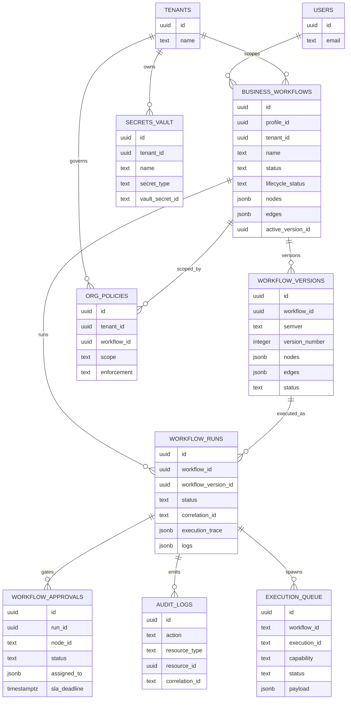

# 06 Data Model

## Summary

The workflow data model is split across the frontend `business_workflows` model, newer Supabase migrations, older archived migrations, AutomationOS runtime types, and Electron local SQLite. The intended enterprise model is visible, but the actual Studio route persists only a small subset.

## Current Workflow Entities

| Entity | Location | Current use |
| --- | --- | --- |
| Workflow | `business_workflows` table, `useBusinessWorkflows.ts` | Studio fetches, creates, and updates workflows. |
| Node | `business_workflows.nodes` JSONB, `WorkflowNode` UI type, `OSNode` runtime type | Studio saves nodes, runtime compiles OS nodes. |
| Edge | `business_workflows.edges` JSONB, `OSEdge` runtime type | Stored by alternate builder; Studio route mostly ignores/regenerates. |
| Execution/Run | `workflow_runs` migrations, local Studio execution state | Schema exists; Studio route does not persist runs. |
| History | `workflow_versions`, `audit_logs`, EventBus history | Versions and audit tables exist; Studio shows static versions/logs. |
| Approval | `workflow_approvals`, `ApprovalEngine` | Schema/service exists; not wired into Studio runtime. |
| Variable | `compileWorkflow().variables` empty array | Placeholder only in Studio compile output. |
| Secret | `secrets_vault`, Electron credential vault | Schema/vault exist; Studio runtime does not bind secrets to nodes. |
| Credential | Electron credential vault, provider manifests | Local desktop support; not unified with Studio node config. |
| Environment | Not found as a Studio workflow model | Missing. |
| User | Supabase auth user | Used by hooks and RLS. |
| Workspace | Mentioned in policy schema as workspace scope | Not clearly wired to Studio workflows. |
| Team | Static `TEAM` data in Studio | UI-only demo state. |
| Permission | RLS policies, `compileWorkflow().permissions` empty array | Partial. |
| Role | Role helper used in RLS policies | Exists for admin policies; no Studio role UI found. |
| Organization | `tenant_id` in newer tables | Partial; not surfaced in Studio route. |
| Version/Draft/Publish | `workflow_versions`, `WorkflowVersionManager` | Infrastructure exists; Studio publish not wired. |

## `business_workflows`

Frontend hook model:

```ts
interface BusinessWorkflow {
  id: string;
  profile_id: string;
  name: string;
  description: string | null;
  status: 'draft' | 'active' | 'paused';
  nodes: any[];
  edges: any[];
  run_count: number;
  created_at: string;
  updated_at: string;
}
```

The original `business_workflows` table appears in archived migration `supabase/migrations/archive/old-migrations/20260629000000_chatr_business_phase4.sql`. Newer migrations extend it with `lifecycle_status`, `active_version_id`, and `tenant_id`.

Risk: the active migration set appears to extend `business_workflows`, but the table creation migration is archived. A clean database may require another active table definition not identified in this audit.

## `workflow_versions`

Defined in `supabase/migrations/20260709000007_phase4_workflow_versioning.sql`.

Key fields:

- `workflow_id`
- `semver`
- `version_number`
- `nodes`
- `edges`
- `status`
- `published_at`
- `published_by`
- `change_summary`
- `notes`
- `tenant_id`
- `created_by`

RLS is based on `created_by = auth.uid()`. That may be too restrictive for team/shared workflow editing unless additional policies exist elsewhere.

## `workflow_runs`

Two different active migrations define `workflow_runs`:

- `20260709000001_phase1_missing_tables_rls_hardening.sql`
- `20260709000008_phase4_workflow_runs_audit.sql`

The later migration uses `CREATE TABLE IF NOT EXISTS`, so if the earlier simpler table exists first, richer run columns may not be added. This is a schema drift blocker.

Richer intended fields include:

- `workflow_id`
- `workflow_version_id`
- `trigger_type`
- `trigger_payload`
- `started_by`
- `tenant_id`
- `correlation_id`
- `status`
- `current_node_id`
- `execution_trace`
- `duration_ms`
- `queue_wait_ms`
- `ai_tokens_used`
- `ai_cost_usd`
- `approval_wait_ms`
- `node_durations`
- `provider_latencies`
- `memory_snapshot`
- `checkpoint_at`
- `queue_ids`
- `error_log`
- `retry_count`
- `max_retries`
- `logs`

Studio currently does not create these rows.

## `workflow_approvals`

Defined in `20260709000009_phase4_approvals_vault.sql`.

Fields include:

- `run_id`
- `workflow_id`
- `node_id`
- `correlation_id`
- `routing_type`
- `assigned_to`
- `assigned_roles`
- `status`
- `decision`
- `reason`
- `resolved_by`
- `sla_deadline`
- `escalation_rules`
- `delegated_to`
- `history`

`ApprovalEngine.ts` can create and resolve approvals, but the frontend runtime does not call it for approval nodes.

## `secrets_vault`

Defined in `20260709000009_phase4_approvals_vault.sql`.

Important properties:

- Stores `vault_secret_id`, not plaintext.
- Supports `secret_type`.
- Supports plugin/capability allow lists.
- Has expiry and last-access metadata.
- RLS limits access to admins.

Studio nodes do not bind to `secrets_vault` entries today.

## `execution_queue`

Defined in `20260709000006_phase3_execution_queue.sql`.

Represents queued execution work:

- `workflow_id`
- `execution_id`
- `capability`
- `provider`
- `priority`
- `payload`
- `status`
- `scheduled_at`
- `retry_count`
- `max_retries`
- `error`
- `metadata`
- `worker_id`
- `created_by`

Studio does not enqueue runs into this table.

## `org_policies`

Defined in `20260709000010_phase5_policy_engine.sql`.

Represents enterprise governance:

- tenant/workspace/workflow scope
- capability scope
- rule type and conditions
- enforcement mode
- approval group
- rate limit fields
- priority/enabled

Studio does not evaluate policies before executing nodes.

## Event and Observability Data

`20260710000001_stage1_production_validation.sql` adds separate production validation schemas such as:

- `platform_events`
- `workflow_state`
- `workflow_checkpoints`
- `provider_runs`
- `workflow_metrics`
- `ai_traces`

These are not clearly wired to `WorkflowStudio` local test runs.

## Electron Local Data

Electron core has separate local data stores:

- `execution_ledger` in `electron/chatr-core/execution/execution-ledger.cjs`.
- Local SQLite persistence in `electron/chatr-core/db/persistence.cjs`.
- Credential vault JSON in `electron/chatr-core/credential-vault.cjs`.

These support desktop execution, but are not the Supabase-backed Studio workflow model.

## ER Diagram



## Data Model Risks

| Risk | Impact |
| --- | --- |
| Multiple active `workflow_runs` definitions | Clean migrations can produce incomplete run schema. |
| Empty Supabase generated types | Type safety is reduced for all database interactions. |
| Edges ignored by Studio | Saved workflow graph cannot represent real branching. |
| Runtime state is in memory | Run history, resume, and analytics are not durable. |
| Versions not wired to publish | Draft/published lifecycle is not enforceable. |
| Secrets not wired to nodes | Credentials may be handled ad hoc. |
| Team/workspace model unclear | Enterprise collaboration and ownership are incomplete. |

## Data Model Maturity

Score: 42/100.

The intended model is broad and promising, but the active route uses only a fraction of it and there are schema consistency risks.
