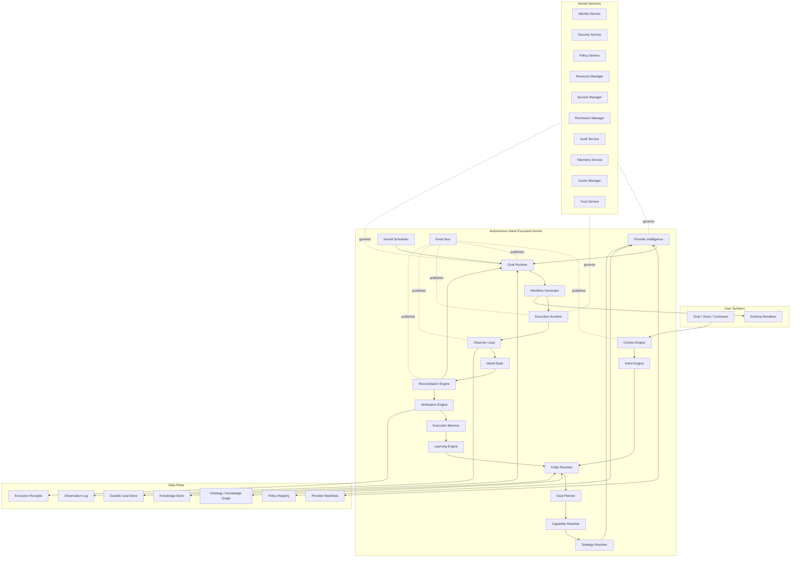
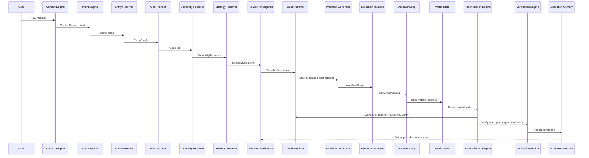
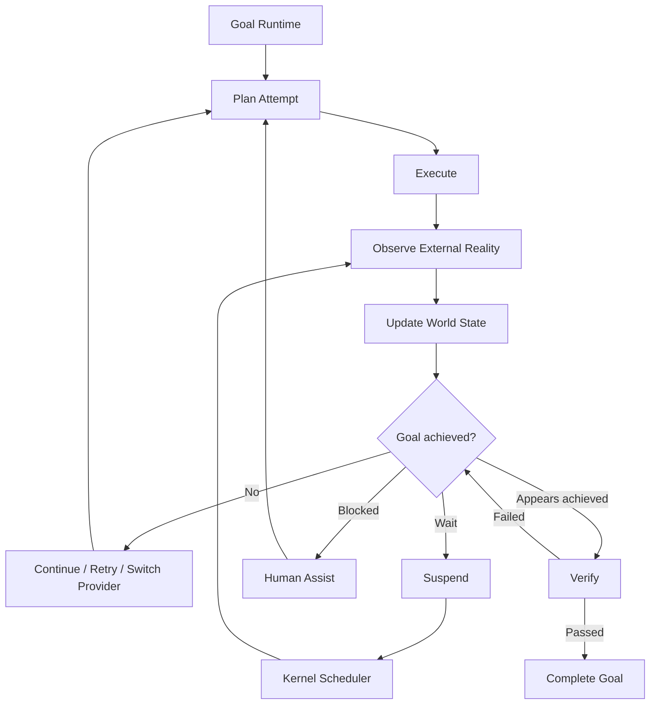
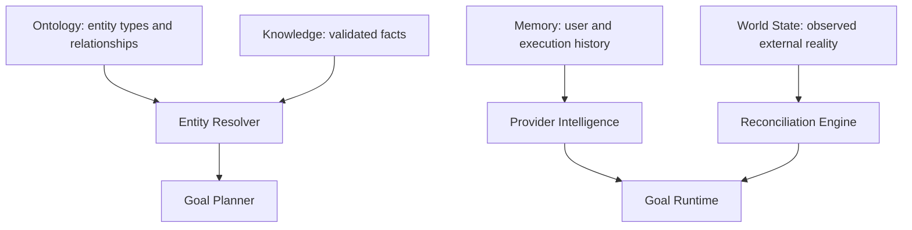
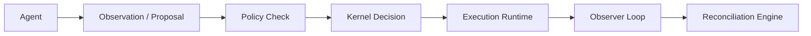
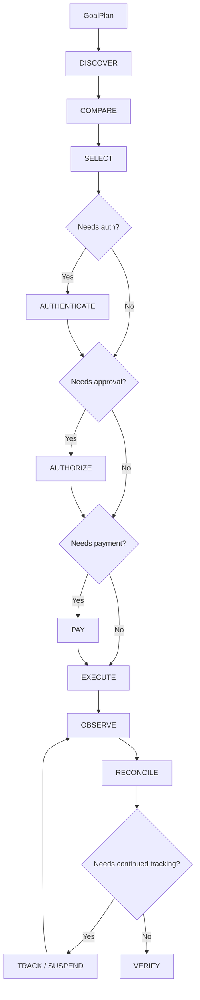
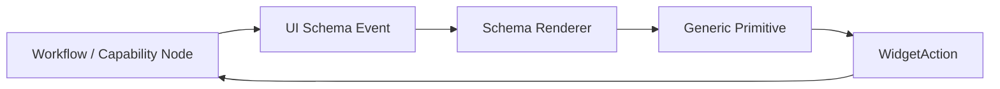

# Autonomous Intent Execution OS Architecture Diagrams

Date: 2026-07-15
Status: CHATR Architecture v1.0 frozen diagrams; Kernel ABI v0.9 RC

## Kernel Boundary

## Request Lifecycle

## Autonomous Execution Loop

## Provider Selection

```mermaid
flowchart LR
  Request["CapabilityRequest"] --> Filter["Filter manifests by capability"]
  Filter --> Strategy["Apply StrategySelection"]
  Strategy --> EntityFit["Match supported entities"]
  EntityFit --> PolicyFit["Apply policies and permissions"]
  PolicyFit --> Trust["Apply trust assessment"]
  Trust --> Resources["Acquire resource lease"]
  Resources --> ModeOrder["Enforce API -> Native App -> Browser Runtime -> Human Assist"]
  ModeOrder --> Score["Score latency, reliability, cost, history, preferences"]
  Score --> Select["ProviderSelection"]
```

## Knowledge Separation

Ontology, Knowledge, Memory, and World State are separate stores. The kernel may correlate them, but it must not collapse them into one mutable bucket.

## Agent Boundary

Agents never execute directly. They propose; the kernel checks policy, leases resources, decides, executes, observes, and reconciles.

## Workflow Composition

## Schema-Driven UI

No UI layer branches on food, travel, hotels, flights, banking, healthcare, government, or shopping. Those labels can appear inside payload data only.
