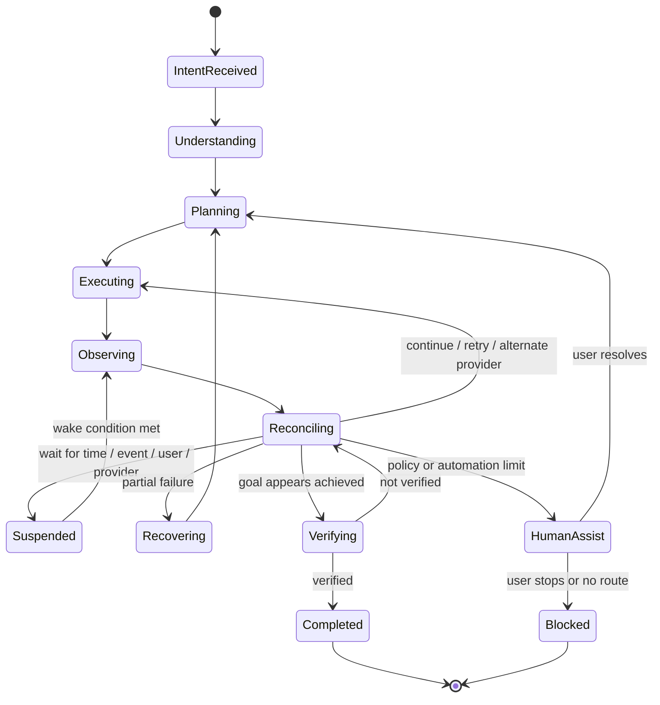

# Autonomous Execution Model

Date: 2026-07-15
Status: CHATR Architecture v1.0 frozen; guardrail for future Kernel ABI v1.0 freeze

## Thesis

CHATR is an Autonomous Intent Execution Operating System.

It does not stop at understanding, reasoning, planning, or launching a workflow. It continuously observes external reality, reconciles that reality against the user's goal, adapts the plan, and continues until the goal is verified complete or an explicit stopping condition is reached.

```text
Understand
-> Reason
-> Plan
-> Execute
-> Observe
-> Recover
-> Continue
-> Verify
-> Finish Goal
```

The important OS behavior is `Continue`.

## Goal Lifecycle



## Core Runtime Layers

| Layer | Responsibility |
| --- | --- |
| Goal Runtime | Owns durable goal state across minutes, days, weeks, restarts, and provider callbacks. |
| World State | Records observed external reality and derived goal progress. |
| Observer Loop | Polls, subscribes, receives callbacks, and ingests external state changes. |
| Reconciliation Engine | Compares World State with GoalPlan and decides continue, retry, wait, recover, switch provider, ask user, or stop. |
| Kernel Scheduler | Wakes suspended goals by time, event, provider signal, retry policy, or user action. |
| Event Bus | Publishes every state transition and allows extensible subscribers. |
| Verification Engine | Determines whether the real-world goal is actually complete. |
| Execution Memory | Improves future provider selection and recovery strategies from observed outcomes. |
| Kernel Services | Provide identity, security, policy, resource, secrets, permissions, audit, telemetry, cache, and trust infrastructure. |

## Kernel Services

Autonomy requires shared kernel services. They must be explicit dependencies of execution, not helper logic hidden inside providers.

Required services:

- Identity Service
- Security Service
- Policy Service
- Resource Manager
- Secrets Manager
- Permission Manager
- Audit Service
- Telemetry Service
- Cache Manager
- Trust Service

Provider Intelligence may consume service outputs, but it must not own these services.

Service outputs become explicit records such as `PolicyDecision`, `TrustAssessment`, `ResourceLease`, scoped identity references, permission grants, audit receipts, telemetry events, and cache freshness metadata.

## Strategy Layer

Capability resolution is not enough. The runtime chain is:

```text
Capability -> Strategy -> Provider -> Execution Mode
```

Strategies include fastest, cheapest, highest rated, most trusted, local first, privacy first, energy efficient, offline first, user preferred, and policy required.

Strategy selection is where user preference, policy, trust, resource pressure, context, and execution memory become an explicit decision before provider ranking.

## World State

The kernel needs a model of reality because external conditions change during execution.

Examples:

- provider API fails
- provider accepts but later rejects
- inventory disappears
- price changes
- payment fails
- appointment slot expires
- user authentication expires
- provider returns waitlisted state
- document application moves to pending review

World State is not a provider response cache. It is the kernel's current belief about the goal's real-world status, with provenance and confidence.

## Knowledge Separation

The architecture keeps four stores separate:

- Ontology defines entity types and relationships.
- Knowledge stores validated facts.
- Memory stores user preferences and execution history.
- World State stores observed reality for goals.

These stores may reference each other, but they do not replace each other.

## Observer Loop

The Observer Loop ingests state from:

- provider APIs
- provider webhooks
- browser runtime checks
- native app callbacks
- notifications
- email/SMS receipts
- calendar state
- payment receipts
- human user input
- scheduled polling

Every observation is an event. Observations never directly mark a goal complete; they feed reconciliation and verification.

## State Reconciliation

The Reconciliation Engine answers one question:

```text
Given the user's goal and the observed world state, what should the kernel do next?
```

Possible decisions:

- continue current workflow
- retry same provider
- switch execution mode
- switch provider
- collect missing input
- wait until a scheduled time
- ask the user
- escalate to human assist
- cancel or compensate prior action
- verify completion
- mark blocked

Example:

```text
Goal: reserve a ticket
Observation: selected provider returned 503
World State: goal not achieved
Reconciliation: switch provider, resume at DISCOVER/COMPARE
```

## Kernel Scheduler

The scheduler owns deferred execution for long-running goals.

Wake triggers:

- absolute time
- relative delay
- retry policy
- provider webhook
- notification arrival
- payment status change
- user response
- network restoration
- app restart

The scheduler must persist wake conditions. If CHATR restarts, suspended goals must resume from durable state.

## Long-Running Goals

Some goals cannot complete in one session.

Examples:

- passport renewal
- visa application
- insurance claim
- loan processing
- recruitment process
- waitlisted booking
- delayed delivery
- bill dispute

Long-running goals require:

- durable GoalRuntimeState
- resumable WorkflowGraph attempts
- scheduled observation
- user-visible status
- verification evidence
- recovery history

## Event Bus

The kernel should be event-driven. Sequential calls are implementation details; state transitions are events.

Required core events:

- `IntentReceived`
- `ContextResolved`
- `IntentResolved`
- `EntityResolved`
- `GoalCreated`
- `GoalPlanned`
- `CapabilityRequested`
- `ProviderCandidatesFound`
- `ProviderSelected`
- `WorkflowCreated`
- `ExecutionStarted`
- `ExecutionProgressed`
- `ExecutionFailed`
- `ObservationRecorded`
- `WorldStateUpdated`
- `ReconciliationDecided`
- `GoalSuspended`
- `GoalResumed`
- `RecoveryStarted`
- `HumanAssistRequested`
- `VerificationStarted`
- `VerificationPassed`
- `VerificationFailed`
- `GoalCompleted`
- `GoalBlocked`
- `LearningRecorded`

Every event must include:

- event id
- goal id
- correlation id
- timestamp
- actor
- payload schema version
- causation id
- optional provider id
- optional workflow id

## Recovery Model

Recovery is kernel-owned, not provider-owned.

Recovery strategies:

- retry same provider with backoff
- retry same provider via a different execution mode
- switch provider
- refresh authentication
- re-run discovery
- compensate partial execution
- ask user to choose among alternatives
- escalate to human assist
- suspend until a better time

Recovery stops when:

- goal is verified complete
- user cancels
- policy blocks continuation
- max recovery attempts are exceeded
- all providers are exhausted
- required external state cannot be observed

## Multi-Agent Extension Point

Kernel ABI v0.9 does not require multi-agent planning, but it defines the boundary now.

Possible agents:

- Planner Agent
- Search Agent
- Execution Agent
- Observer Agent
- Verification Agent
- Recovery Agent
- Policy Agent

Agents may produce candidate observations and proposals, but the kernel owns state, policy, eventing, resources, identity, secrets, reconciliation, execution, and final transitions.

Required flow:

```text
Agent -> Observation/Proposal -> Policy Check -> Kernel Decision -> Execution
```

Agents never execute directly.

## Required Questions Before ABI v1.0

1. Where does the kernel continuously observe external world state?
2. How are long-running goals resumed after restart?
3. How does the kernel recover from partial provider failure?
4. How are provider failures reconciled against the original goal?
5. How are asynchronous events propagated?
6. How are suspended goals resumed days later?
7. How does the kernel decide the goal is truly complete?
8. Which kernel service owns identity, policy, trust, resources, secrets, permissions, audit, telemetry, and cache for this action?
9. Which strategy was selected before provider ranking?
10. Is any agent output a proposal rather than an execution command?

## Minimum v1.0 Readiness Criteria

Kernel ABI v1.0 can be frozen only when:

- Goal Runtime exists as a durable state machine.
- World State exists with observation provenance.
- Observer Loop feeds World State.
- Reconciliation Engine can replan after failure.
- Kernel Scheduler persists and resumes suspended goals.
- Event Bus has typed lifecycle events.
- Verification Engine gates completion.
- Kernel services exist for identity, security, policy, resources, secrets, permissions, audit, telemetry, cache, and trust.
- Strategy selection is explicit between capability resolution and provider selection.
- Agent proposals are policy checked before kernel execution.
- Acceptance tests include at least one provider failure, one delayed goal, one suspended/resumed goal, and one recovery route.
