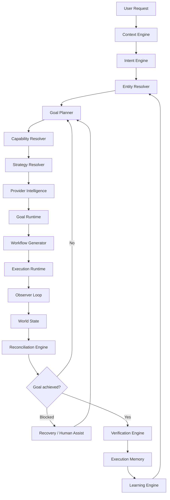
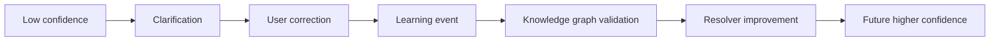

# CHATR Kernel ABI v0.9 Release Candidate

Status: release candidate, not frozen
Date: 2026-07-15

## Kernel Philosophy

CHATR is an Autonomous Intent Execution Operating System. It does not stop at understanding or planning. It continuously observes, adapts, and executes until the user's real-world goal is achieved or an explicit stopping condition is reached.

This document should be treated as Kernel ABI v0.9 RC. It becomes ABI v1.0 only after autonomous execution, world state, eventing, scheduling, reconciliation, and long-running goal recovery are represented in implementation and tests.

The kernel must not know industries. It only knows:

- Intent
- Entity
- Goal
- Capability
- Strategy
- Context
- Provider
- Execution
- Observation
- World State
- Reconciliation
- Verification
- Learning

Industry concepts belong to ontology or provider manifests. They are data, not runtime branches.

Kernel services are first-class OS infrastructure. Identity, Security, Policy, Resource, Secrets, Permission, Audit, Telemetry, Cache, and Trust services must be shared kernel services, not hidden inside Provider Intelligence or provider adapters.

## Target Pipeline



The key loop is:

```text
Plan -> Execute -> Observe -> Reconcile -> Continue -> Verify -> Complete
```

The kernel is goal-reconciling, not merely workflow-executing.

Runtime selection always follows:

```text
Capability -> Strategy -> Provider -> Execution Mode
```

A capability says what must be done. A strategy says how the kernel should pursue it. A provider is only one possible executor.

## ABI Objects

### ContextFrame

Built before planning.

```json
{
  "abi": "chatr.context.v0_9_rc",
  "request_id": "uuid",
  "time": {},
  "device": {},
  "gps": {},
  "wallet": {},
  "preferences": {},
  "permissions": {},
  "history": {},
  "execution_memory": {},
  "active_environment": {},
  "world_state_refs": []
}
```

### IntentFrame

The Intent Engine output. It must not contain domain or provider IDs.

```json
{
  "abi": "chatr.intent.v0_9_rc",
  "intent": "ORDER",
  "entity": {
    "raw": "Chicken Biryani",
    "span": [6, 21]
  },
  "confidence": 0.97,
  "constraints": {}
}
```

Allowed intent verbs are generic, for example:

- GET
- FIND
- BOOK
- ORDER
- RESERVE
- PAY
- TRANSFER
- RENEW
- SCHEDULE
- TRACK
- CANCEL
- UPDATE
- CREATE
- SEND
- VERIFY

### EntityGraph

Resolved by ontology, not by planner.

```json
{
  "abi": "chatr.entity_graph.v0_9_rc",
  "root": {
    "id": "entity_1",
    "raw": "Chicken Biryani",
    "types": ["Dish", "MerchantItem"],
    "confidence": 0.94
  },
  "relations": [
    {
      "from": "entity_1",
      "type": "FULFILLED_BY",
      "to_type": "Merchant"
    }
  ],
  "validation": {
    "source": "knowledge_graph",
    "status": "unverified"
  }
}
```

Entity types may include ontology labels such as `Dish`, `Accommodation`, `TransportLeg`, `Bill`, `IdentityDocument`, `Appointment`, or `Ticket`. Kernel code must treat these as data.

### GoalPlan

The Goal Planner turns intent plus entity graph into universal goal steps.

```json
{
  "abi": "chatr.goal_plan.v0_9_rc",
  "goal": {
    "verb": "ORDER",
    "entity_ref": "entity_1"
  },
  "steps": [
    { "id": "g1", "capability": "DISCOVER", "entity_ref": "entity_1" },
    { "id": "g2", "capability": "COMPARE", "depends_on": ["g1"] },
    { "id": "g3", "capability": "SELECT", "depends_on": ["g2"] },
    { "id": "g4", "capability": "AUTHENTICATE", "depends_on": ["g3"] },
    { "id": "g5", "capability": "PAY", "depends_on": ["g4"] },
    { "id": "g6", "capability": "EXECUTE", "depends_on": ["g5"] },
    { "id": "g7", "capability": "OBSERVE", "depends_on": ["g6"] },
    { "id": "g8", "capability": "RECONCILE", "depends_on": ["g7"] },
    { "id": "g9", "capability": "VERIFY", "depends_on": ["g8"] }
  ],
  "stopping_conditions": [
    "verified_complete",
    "user_cancelled",
    "policy_blocked",
    "max_recovery_attempts_exceeded"
  ]
}
```

### CapabilityRequest

```json
{
  "abi": "chatr.capability_request.v0_9_rc",
  "capability": "DISCOVER",
  "capability_contract_version": "1.0.0",
  "entity_ref": "entity_1",
  "input_schema": {},
  "constraints": {},
  "context_requirements": ["gps", "permissions"],
  "risk": "low"
}
```

### CapabilityGraph

The Capability Resolver converts a durable `GoalPlan` into a graph of universal
capability requests. The graph is the first Wave 2 execution-core object and is
the input to Strategy Resolver.

```json
{
  "abi": "chatr.capability_graph.v0_9_rc",
  "goal_id": "uuid",
  "goal_plan_ref": "goal_plan_123",
  "nodes": [
    {
      "node_id": "cap_node_1",
      "capability": "DISCOVER",
      "capability_contract_version": "1.0.0",
      "depends_on": [],
      "capability_request": {}
    }
  ],
  "edges": []
}
```

### CapabilityContract

Capabilities evolve through explicit contract versions. A capability name alone is not enough to define runtime compatibility.

```json
{
  "abi": "chatr.capability_contract.v0_9_rc",
  "capability": "DISCOVER",
  "contract_version": "1.0.0",
  "input_schema": {},
  "output_schema": {},
  "policy_requirements": {
    "default_risk": "low",
    "approval": "none"
  },
  "strategy_support": [
    "fastest",
    "cheapest",
    "highest_rated",
    "most_trusted",
    "local_first",
    "privacy_first"
  ],
  "expected_observations": [
    "provider_availability",
    "candidate_options"
  ],
  "verification_rules": {
    "required": false,
    "evidence": []
  }
}
```

Capability contract version changes are governed independently from Kernel ABI version changes. Providers must declare which capability contract version they implement.

### StrategySelection

The Strategy Resolver chooses how to pursue a capability before Provider Intelligence ranks providers.

```json
{
  "abi": "chatr.strategy_selection.v0_9_rc",
  "goal_id": "uuid",
  "capability": "DISCOVER",
  "strategy": "most_trusted",
  "reason": "user asked for best option and policy favors trusted providers",
  "constraints": {
    "max_cost": null,
    "privacy": "standard"
  },
  "inputs": {
    "context_ref": "ctx_123",
    "policy_refs": ["policy_1"],
    "memory_refs": ["mem_1"]
  }
}
```

Allowed strategy labels include:

- fastest
- cheapest
- highest_rated
- most_trusted
- local_first
- privacy_first
- energy_efficient
- offline_first
- user_preferred
- policy_required

Strategies are generic. They must not encode industries or providers.

### GoalRuntimeState

Long-running goals are first-class kernel objects. They survive app restarts and can suspend, resume, observe, and replan.

```json
{
  "abi": "chatr.goal_runtime_state.v0_9_rc",
  "goal_id": "uuid",
  "status": "running",
  "intent_ref": "intent_1",
  "entity_graph_ref": "entity_graph_1",
  "active_workflow_id": "wf_123",
  "world_state_ref": "world_123",
  "attempts": 1,
  "suspended_until": null,
  "stopping_conditions": {},
  "last_observed_at": "2026-07-15T00:00:00Z"
}
```

Allowed goal runtime states:

- created
- planning
- running
- observing
- reconciling
- suspended
- waiting_user
- waiting_provider
- recovering
- verifying
- completed
- cancelled
- blocked
- failed

### WorldState

World State records what the kernel currently believes about external reality.

```json
{
  "abi": "chatr.world_state.v0_9_rc",
  "goal_id": "uuid",
  "observations": [
    {
      "id": "obs_1",
      "source": "provider",
      "kind": "execution_status",
      "value": "provider_unavailable",
      "confidence": 0.92,
      "observed_at": "2026-07-15T00:00:00Z"
    }
  ],
  "derived_state": {
    "goal_progress": "not_achieved",
    "blocking_condition": "provider_unavailable"
  }
}
```

### ReconciliationDecision

The Reconciliation Engine decides whether to continue, retry, switch provider, ask the user, wait, or stop.

```json
{
  "abi": "chatr.reconciliation_decision.v0_9_rc",
  "goal_id": "uuid",
  "decision": "switch_provider",
  "reason": "selected provider returned temporary failure",
  "next_capability": "DISCOVER",
  "policy": {
    "requires_user_confirmation": false
  }
}
```

### PolicyDecision

```json
{
  "abi": "chatr.policy_decision.v0_9_rc",
  "goal_id": "uuid",
  "action": "EXECUTE",
  "risk": "medium",
  "decision": "allow_with_approval",
  "required_approvals": ["user.confirmation"],
  "reasons": ["external_action", "provider_trust_medium"]
}
```

### TrustAssessment

Provider trust is computed by the kernel from evidence, not accepted as a static provider claim.

```json
{
  "abi": "chatr.trust_assessment.v0_9_rc",
  "provider_id": "provider.example",
  "trust_score": 0.86,
  "level": "trusted",
  "evidence_refs": ["manifest_signature", "telemetry_30d", "user_preference"],
  "execution_permissions": ["api", "native_app"],
  "requires_approval": false
}
```

### ResourceLease

Scarce execution resources must be leased before use.

```json
{
  "abi": "chatr.resource_lease.v0_9_rc",
  "lease_id": "uuid",
  "goal_id": "uuid",
  "resource": "browser_session",
  "quantity": 1,
  "priority": "normal",
  "expires_at": "2026-07-15T00:10:00Z"
}
```

### ObservationFrame

```json
{
  "abi": "chatr.observation_frame.v0_9_rc",
  "observation_id": "uuid",
  "goal_id": "uuid",
  "workflow_step": "string",
  "sequence": 42,
  "timestamp": "iso8601",
  "source": "browser",
  "observation_type": "dom",
  "confidence": 0.98,
  "payload": {},
  "metadata": {}
}
```

### RecoveryProposal

```json
{
  "abi": "chatr.recovery_proposal.v0_9_rc",
  "proposal_id": "uuid",
  "goal_id": "uuid",
  "workflow_step": "string",
  "proposal_type": "retry_step",
  "reason": "string",
  "confidence": 0.94,
  "evidence_refs": ["uuid"],
  "sequence": 27,
  "correlation_id": "uuid"
}
```

### VerificationResult

```json
{
  "abi": "chatr.verification_result.v0_9_rc",
  "verification_id": "uuid",
  "goal_id": "uuid",
  "result": "verified",
  "confidence": 0.99,
  "evidence_refs": ["uuid"],
  "verification_reason": "string",
  "sequence": 55,
  "correlation_id": "uuid"
}
```

### ExecutionSlot

```json
{
  "abi": "chatr.execution_slot.v0_9_rc",
  "goal_id": "uuid",
  "workflow_step": "string",
  "scheduled_at": "iso8601",
  "priority": 50,
  "lease_id": "uuid",
  "execution_window": "string",
  "sequence": 1
}
```

### WorkflowGraph

```json
{
  "abi": "chatr.workflow_graph.v0_9_rc",
  "graph_id": "uuid",
  "goal_id": "uuid",
  "workflow_version": "1.0",
  "nodes": [
    {
      "node_id": "string",
      "type": "string",
      "action": "string"
    }
  ],
  "edges": [
    {
      "from": "string",
      "to": "string",
      "condition": "string"
    }
  ],
  "metadata": {},
  "deterministic_hash": "string"
}
```

### AgentProposal

Agents may propose, observe, or analyze. They never execute directly.

```json
{
  "abi": "chatr.agent_proposal.v0_9_rc",
  "agent_id": "agent.recovery",
  "goal_id": "uuid",
  "proposal_type": "recovery_strategy",
  "recommended_action": "switch_provider",
  "confidence": 0.82,
  "evidence_refs": ["obs_1", "receipt_1"],
  "requires_policy_check": true
}
```

## Capability Catalog v0.9 RC

The catalog is a list of primitives. No capability ID may encode an industry.

| Capability | Purpose |
| --- | --- |
| DISCOVER | Find possible providers, merchants, resources, records, or options. |
| FETCH | Retrieve a known object or state. |
| COMPARE | Rank or compare options. |
| SELECT | Capture user/system selection. |
| AUTHENTICATE | Establish identity/session/authorization. |
| AUTHORIZE | Obtain explicit user or policy approval. |
| COLLECT_INPUT | Gather structured user/provider fields through schema. |
| PAY | Move money or initiate payment. |
| TRANSFER | Move value between accounts or stores. |
| EXECUTE | Commit the selected provider action. |
| OBSERVE | Read external state after or during execution. |
| RECONCILE | Compare observed world state against the goal and choose the next action. |
| RECOVER | Execute a recovery strategy after partial failure. |
| TRACK | Monitor progress after execution. |
| VERIFY | Confirm real-world completion. |
| SUSPEND | Pause a goal until time, event, provider state, or user action. |
| RESUME | Continue a suspended goal. |
| CANCEL | Reverse or stop a pending action. |
| COMMUNICATE | Send or receive messages. |
| SCHEDULE | Create or modify time-bound commitments. |
| STORE | Persist artifacts or records. |
| NOTIFY | Inform the user or another actor. |
| LEARN | Record validated improvement signals. |

## Provider Manifest ABI v0.9 RC

Provider manifests are data contracts loaded and validated at bootstrap.

```json
{
  "abi": "chatr.provider_manifest.v0_9_rc",
  "provider_id": "provider.example",
  "provider_version": "1.0.0",
  "display_name": "Example Provider",
  "manifest_version": "1.0.0",
  "capabilities": [
    {
      "capability": "DISCOVER",
      "capability_contract_version": "1.0.0",
      "supported_entities": ["MerchantItem", "Appointment", "Bill"],
      "input_schema": {},
      "output_schema": {},
      "execution_modes": ["api", "native_app", "browser_runtime", "human_assist"],
      "strategy_support": ["fastest", "cheapest", "most_trusted", "privacy_first"],
      "authentication": {
        "type": "oauth2",
        "required": true
      },
      "permissions": ["location.read"],
      "rate_limits": {
        "requests_per_minute": 60
      },
      "latency": {
        "p50_ms": 800,
        "p95_ms": 2400
      },
      "reliability": {
        "declared_success_rate": 0.95
      },
      "cost": {
        "model": "free"
      },
      "policies": {
        "requires_user_approval": false,
        "allowed_regions": ["*"]
      },
      "observation": {
        "supports_polling": true,
        "supports_webhooks": false
      },
      "recovery": {
        "retryable_errors": ["timeout", "rate_limited", "temporary_unavailable"],
        "supports_idempotency_key": true
      },
      "resource_profile": {
        "requires": ["network"],
        "optional": ["browser_session"],
        "max_concurrency": 4
      },
      "audit": {
        "emits_action_receipts": true,
        "emits_state_transitions": true
      }
    }
  ],
  "health_check": {
    "mode": "api",
    "endpoint": "/health"
  },
  "compatibility": {
    "kernel_abi": ">=0.9 <1.0"
  },
  "trust_evidence": {
    "manifest_signature": "required",
    "attestation": "optional"
  }
}
```

Required bootstrap validation:

- ABI version is supported.
- Capabilities are in the universal catalog.
- Capability contract versions are supported.
- Supported entities are ontology IDs, not runtime domains.
- Execution modes are valid.
- Strategy support is valid.
- Authentication and permissions are explicit.
- Rate limits, latency, reliability, cost, and policy metadata are present.
- Observation, recovery, resource, audit, and trust evidence metadata are present.
- Input and output schemas validate.

## Provider Intelligence

Provider selection uses a score, not a static route.

```text
score =
  capability_match
  + strategy_fit
  + entity_support
  + context_fit
  + policy_fit
  + trust_score
  + resource_fit
  + user_preference
  + execution_memory_success
  + reliability
  - latency_penalty
  - cost_penalty
  - permission_penalty
```

Execution mode order is mandatory:

1. API
2. Native App
3. Browser Runtime
4. Human Assist

Simulation is allowed only in development, tests, or explicitly marked dry-run mode.

Provider Intelligence must consume `StrategySelection`, `PolicyDecision`, `TrustAssessment`, and `ResourceLease` records. It must not allocate scarce resources, access secrets, decide identity, or bypass policy internally.

## Workflow Graph v0.9 RC

```json
{
  "abi": "chatr.workflow_graph.v0_9_rc",
  "workflow_id": "uuid",
  "goal_id": "uuid",
  "nodes": [
    {
      "id": "node_1",
      "capability": "DISCOVER",
      "provider_selection": {},
      "input": {},
      "requires_approval": false,
      "depends_on": []
    }
  ],
  "policies": {},
  "observation": {
    "strategy": "provider_webhook_or_polling",
    "interval_ms": 60000
  },
  "reconciliation": {
    "enabled": true,
    "max_attempts": 3
  },
  "verification": {
    "required": true
  }
}
```

The Workflow Generator composes from the GoalPlan. It must not contain per-domain branches. Workflows are execution attempts owned by the Goal Runtime; they are not the durable goal itself.

## Schema-Driven UI ABI

The UI renderer receives schema data, not vertical widgets.

```json
{
  "abi": "chatr.ui_schema.v0_9_rc",
  "workflow_id": "uuid",
  "view": {
    "type": "selection",
    "json_schema": {},
    "ui_schema": {},
    "actions": [
      {
        "id": "SELECT",
        "label": "Select",
        "payload_schema": {}
      }
    ]
  }
}
```

Allowed generic view primitives:

- form
- selection
- comparison
- confirmation
- payment
- timeline
- tracking
- verification
- result
- approval
- console

View payloads may contain entity labels from ontology, but renderer code must not branch on industries.

## Intent Learning Loop



Rules:

- User correction creates a learning event.
- Learning event is validated against knowledge graph and provider outcomes.
- Ontology is not directly trained or mutated from a single correction.
- Execution memory improves provider and workflow ranking.
